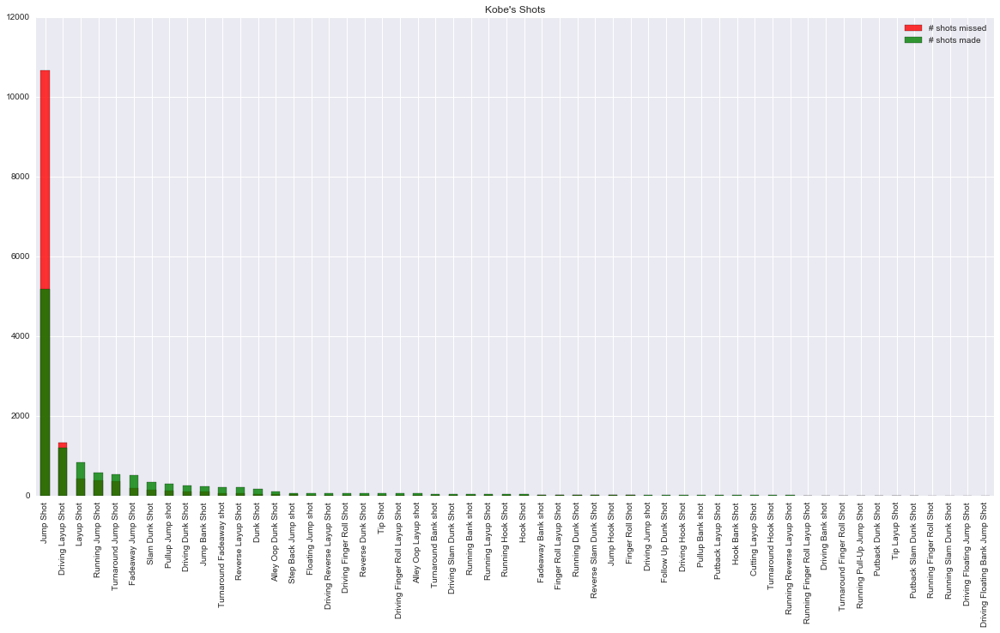
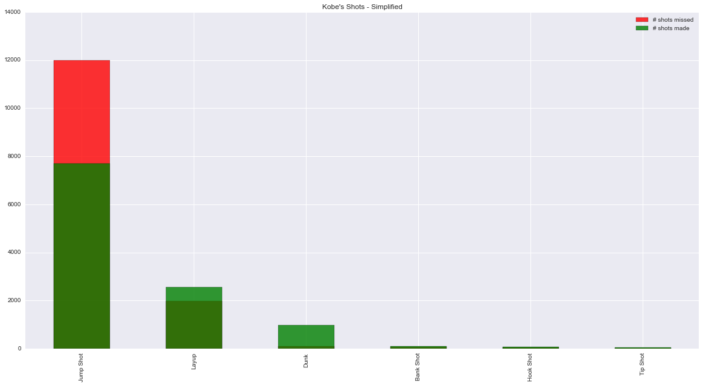
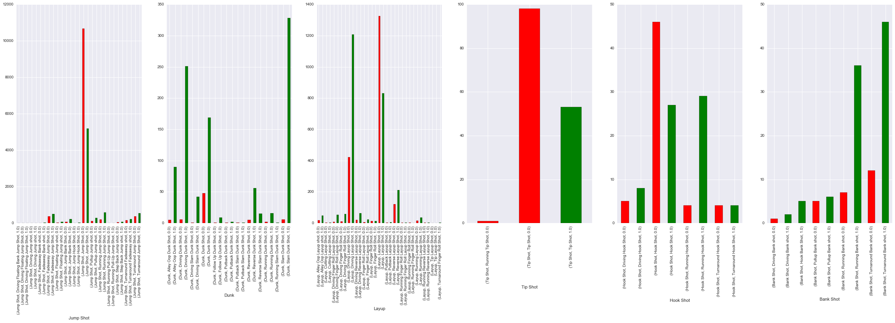
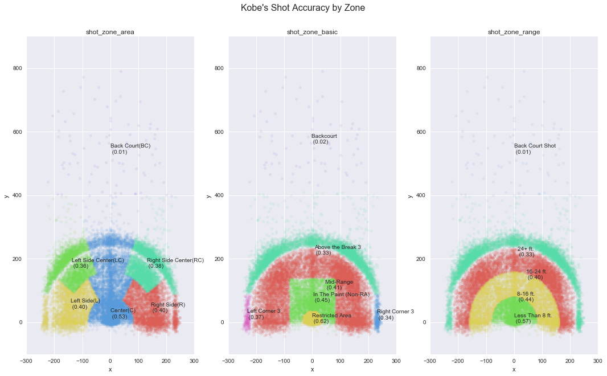
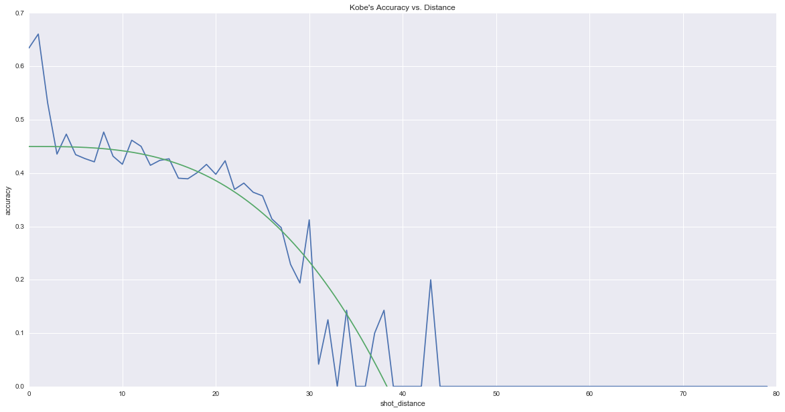
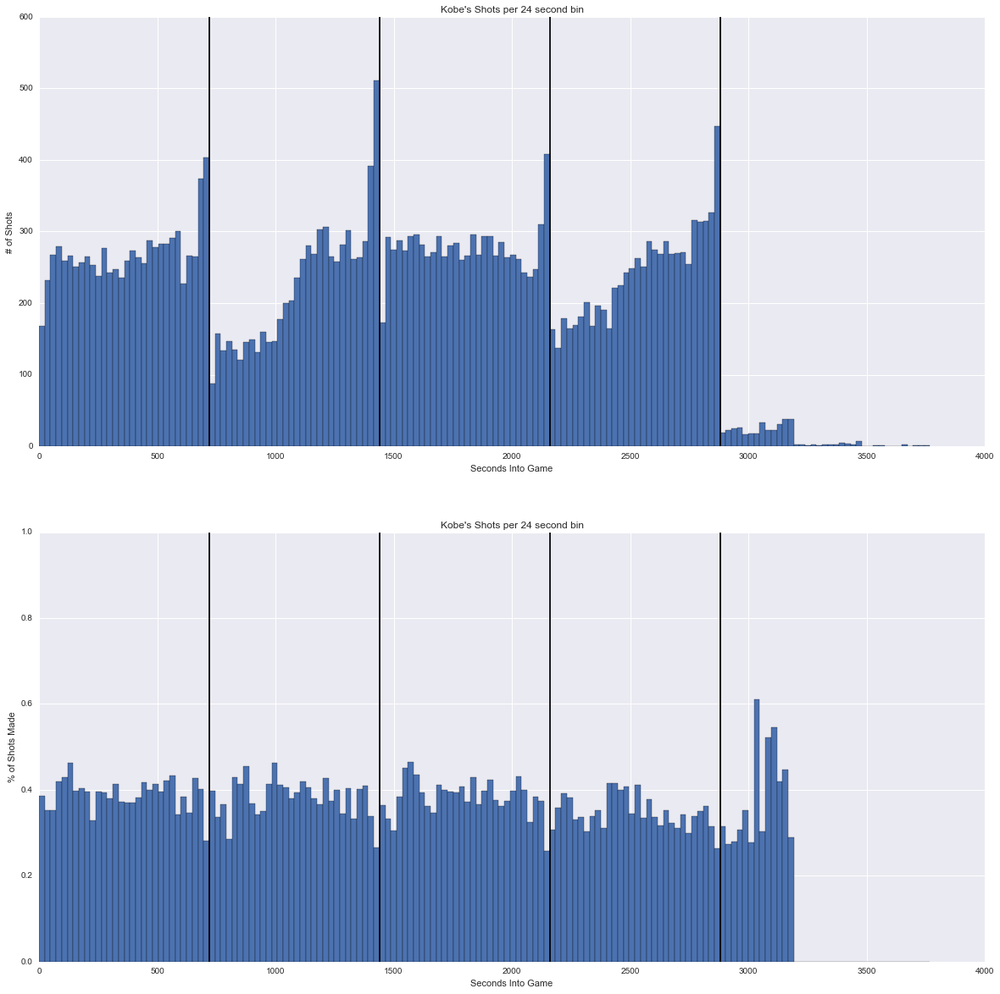
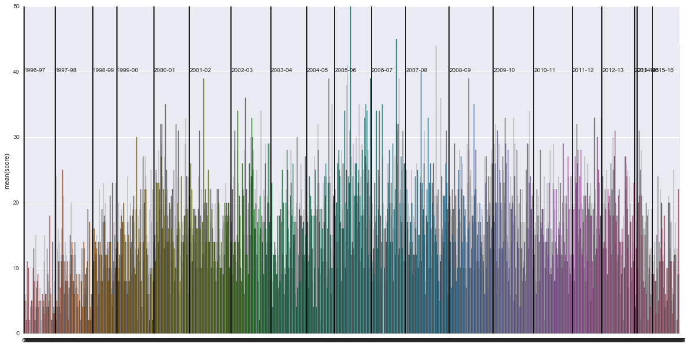
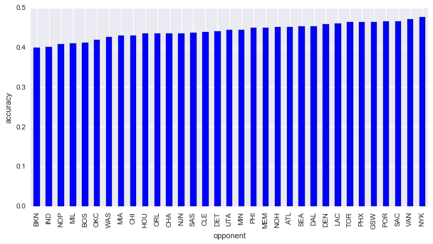
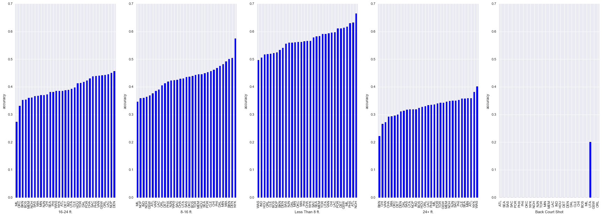

# Overview

Kobe Bryant marked his retirement from the NBA by scoring 60 points in his final game as a Los Angeles Laker on Wednesday, April 12, 2016. Drafted into the NBA at the age of 17, Kobe earned the sport’s highest accolades throughout his long career.

Given complete data on 25697 shots, our mission is to predict his his probability of making 5000 other shots. Scores are calculated based off of "log_loss".


```python
import csv
import pandas as pd
import numpy as np
import scipy as sp
import sklearn
from sklearn.preprocessing import LabelBinarizer
from sklearn.preprocessing import LabelEncoder
pd.set_option('display.max_columns', 999)
from matplotlib import pyplot as plt
import seaborn as sns
%matplotlib inline
```

    /Users/hechengwang/anaconda/lib/python2.7/site-packages/matplotlib/font_manager.py:273: UserWarning: Matplotlib is building the font cache using fc-list. This may take a moment.
      warnings.warn('Matplotlib is building the font cache using fc-list. This may take a moment.')


```python
df = pd.read_csv('data.csv')
```


```python
df.head()
```


<div>
<table border="1" class="dataframe">
  <thead>
    <tr style="text-align: right;">
      <th></th>
      <th>action_type</th>
      <th>combined_shot_type</th>
      <th>game_event_id</th>
      <th>game_id</th>
      <th>lat</th>
      <th>loc_x</th>
      <th>loc_y</th>
      <th>lon</th>
      <th>minutes_remaining</th>
      <th>period</th>
      <th>playoffs</th>
      <th>season</th>
      <th>seconds_remaining</th>
      <th>shot_distance</th>
      <th>shot_made_flag</th>
      <th>shot_type</th>
      <th>shot_zone_area</th>
      <th>shot_zone_basic</th>
      <th>shot_zone_range</th>
      <th>team_id</th>
      <th>team_name</th>
      <th>game_date</th>
      <th>matchup</th>
      <th>opponent</th>
      <th>shot_id</th>
    </tr>
  </thead>
  <tbody>
    <tr>
      <th>0</th>
      <td>Jump Shot</td>
      <td>Jump Shot</td>
      <td>10</td>
      <td>20000012</td>
      <td>33.9723</td>
      <td>167</td>
      <td>72</td>
      <td>-118.1028</td>
      <td>10</td>
      <td>1</td>
      <td>0</td>
      <td>2000-01</td>
      <td>27</td>
      <td>18</td>
      <td>NaN</td>
      <td>2PT Field Goal</td>
      <td>Right Side(R)</td>
      <td>Mid-Range</td>
      <td>16-24 ft.</td>
      <td>1610612747</td>
      <td>Los Angeles Lakers</td>
      <td>2000-10-31</td>
      <td>LAL @ POR</td>
      <td>POR</td>
      <td>1</td>
    </tr>
    <tr>
      <th>1</th>
      <td>Jump Shot</td>
      <td>Jump Shot</td>
      <td>12</td>
      <td>20000012</td>
      <td>34.0443</td>
      <td>-157</td>
      <td>0</td>
      <td>-118.4268</td>
      <td>10</td>
      <td>1</td>
      <td>0</td>
      <td>2000-01</td>
      <td>22</td>
      <td>15</td>
      <td>0</td>
      <td>2PT Field Goal</td>
      <td>Left Side(L)</td>
      <td>Mid-Range</td>
      <td>8-16 ft.</td>
      <td>1610612747</td>
      <td>Los Angeles Lakers</td>
      <td>2000-10-31</td>
      <td>LAL @ POR</td>
      <td>POR</td>
      <td>2</td>
    </tr>
    <tr>
      <th>2</th>
      <td>Jump Shot</td>
      <td>Jump Shot</td>
      <td>35</td>
      <td>20000012</td>
      <td>33.9093</td>
      <td>-101</td>
      <td>135</td>
      <td>-118.3708</td>
      <td>7</td>
      <td>1</td>
      <td>0</td>
      <td>2000-01</td>
      <td>45</td>
      <td>16</td>
      <td>1</td>
      <td>2PT Field Goal</td>
      <td>Left Side Center(LC)</td>
      <td>Mid-Range</td>
      <td>16-24 ft.</td>
      <td>1610612747</td>
      <td>Los Angeles Lakers</td>
      <td>2000-10-31</td>
      <td>LAL @ POR</td>
      <td>POR</td>
      <td>3</td>
    </tr>
    <tr>
      <th>3</th>
      <td>Jump Shot</td>
      <td>Jump Shot</td>
      <td>43</td>
      <td>20000012</td>
      <td>33.8693</td>
      <td>138</td>
      <td>175</td>
      <td>-118.1318</td>
      <td>6</td>
      <td>1</td>
      <td>0</td>
      <td>2000-01</td>
      <td>52</td>
      <td>22</td>
      <td>0</td>
      <td>2PT Field Goal</td>
      <td>Right Side Center(RC)</td>
      <td>Mid-Range</td>
      <td>16-24 ft.</td>
      <td>1610612747</td>
      <td>Los Angeles Lakers</td>
      <td>2000-10-31</td>
      <td>LAL @ POR</td>
      <td>POR</td>
      <td>4</td>
    </tr>
    <tr>
      <th>4</th>
      <td>Driving Dunk Shot</td>
      <td>Dunk</td>
      <td>155</td>
      <td>20000012</td>
      <td>34.0443</td>
      <td>0</td>
      <td>0</td>
      <td>-118.2698</td>
      <td>6</td>
      <td>2</td>
      <td>0</td>
      <td>2000-01</td>
      <td>19</td>
      <td>0</td>
      <td>1</td>
      <td>2PT Field Goal</td>
      <td>Center(C)</td>
      <td>Restricted Area</td>
      <td>Less Than 8 ft.</td>
      <td>1610612747</td>
      <td>Los Angeles Lakers</td>
      <td>2000-10-31</td>
      <td>LAL @ POR</td>
      <td>POR</td>
      <td>5</td>
    </tr>
  </tbody>
</table>
</div>


```python
df.describe()
```


<div>
<table border="1" class="dataframe">
  <thead>
    <tr style="text-align: right;">
      <th></th>
      <th>game_event_id</th>
      <th>game_id</th>
      <th>lat</th>
      <th>loc_x</th>
      <th>loc_y</th>
      <th>lon</th>
      <th>minutes_remaining</th>
      <th>period</th>
      <th>playoffs</th>
      <th>seconds_remaining</th>
      <th>shot_distance</th>
      <th>shot_made_flag</th>
      <th>team_id</th>
      <th>shot_id</th>
    </tr>
  </thead>
  <tbody>
    <tr>
      <th>count</th>
      <td>30697.000000</td>
      <td>30697.000000</td>
      <td>30697.000000</td>
      <td>30697.000000</td>
      <td>30697.000000</td>
      <td>30697.000000</td>
      <td>30697.000000</td>
      <td>30697.000000</td>
      <td>30697.000000</td>
      <td>30697.000000</td>
      <td>30697.000000</td>
      <td>25697.000000</td>
      <td>30697</td>
      <td>30697.000000</td>
    </tr>
    <tr>
      <th>mean</th>
      <td>249.190800</td>
      <td>24764065.868065</td>
      <td>33.953192</td>
      <td>7.110499</td>
      <td>91.107535</td>
      <td>-118.262690</td>
      <td>4.885624</td>
      <td>2.519432</td>
      <td>0.146562</td>
      <td>28.365085</td>
      <td>13.437437</td>
      <td>0.446161</td>
      <td>1610612747</td>
      <td>15349.000000</td>
    </tr>
    <tr>
      <th>std</th>
      <td>150.003712</td>
      <td>7755174.890198</td>
      <td>0.087791</td>
      <td>110.124578</td>
      <td>87.791361</td>
      <td>0.110125</td>
      <td>3.449897</td>
      <td>1.153665</td>
      <td>0.353674</td>
      <td>17.478949</td>
      <td>9.374189</td>
      <td>0.497103</td>
      <td>0</td>
      <td>8861.604943</td>
    </tr>
    <tr>
      <th>min</th>
      <td>2.000000</td>
      <td>20000012.000000</td>
      <td>33.253300</td>
      <td>-250.000000</td>
      <td>-44.000000</td>
      <td>-118.519800</td>
      <td>0.000000</td>
      <td>1.000000</td>
      <td>0.000000</td>
      <td>0.000000</td>
      <td>0.000000</td>
      <td>0.000000</td>
      <td>1610612747</td>
      <td>1.000000</td>
    </tr>
    <tr>
      <th>25%</th>
      <td>110.000000</td>
      <td>20500077.000000</td>
      <td>33.884300</td>
      <td>-68.000000</td>
      <td>4.000000</td>
      <td>-118.337800</td>
      <td>2.000000</td>
      <td>1.000000</td>
      <td>0.000000</td>
      <td>13.000000</td>
      <td>5.000000</td>
      <td>0.000000</td>
      <td>1610612747</td>
      <td>7675.000000</td>
    </tr>
    <tr>
      <th>50%</th>
      <td>253.000000</td>
      <td>20900354.000000</td>
      <td>33.970300</td>
      <td>0.000000</td>
      <td>74.000000</td>
      <td>-118.269800</td>
      <td>5.000000</td>
      <td>3.000000</td>
      <td>0.000000</td>
      <td>28.000000</td>
      <td>15.000000</td>
      <td>0.000000</td>
      <td>1610612747</td>
      <td>15349.000000</td>
    </tr>
    <tr>
      <th>75%</th>
      <td>368.000000</td>
      <td>29600474.000000</td>
      <td>34.040300</td>
      <td>95.000000</td>
      <td>160.000000</td>
      <td>-118.174800</td>
      <td>8.000000</td>
      <td>3.000000</td>
      <td>0.000000</td>
      <td>43.000000</td>
      <td>21.000000</td>
      <td>1.000000</td>
      <td>1610612747</td>
      <td>23023.000000</td>
    </tr>
    <tr>
      <th>max</th>
      <td>659.000000</td>
      <td>49900088.000000</td>
      <td>34.088300</td>
      <td>248.000000</td>
      <td>791.000000</td>
      <td>-118.021800</td>
      <td>11.000000</td>
      <td>7.000000</td>
      <td>1.000000</td>
      <td>59.000000</td>
      <td>79.000000</td>
      <td>1.000000</td>
      <td>1610612747</td>
      <td>30697.000000</td>
    </tr>
  </tbody>
</table>
</div>


I've split up my analysis on "Shot Type", "Location", "Time", and "Game".

# Analysis - Shot Type


```python
print df['action_type'].unique()
print df['combined_shot_type'].unique()
```

    ['Jump Shot' 'Driving Dunk Shot' 'Layup Shot' 'Running Jump Shot'
     'Driving Layup Shot' 'Reverse Layup Shot' 'Reverse Dunk Shot'
     'Slam Dunk Shot' 'Turnaround Jump Shot' 'Tip Shot' 'Running Hook Shot'
     'Alley Oop Dunk Shot' 'Dunk Shot' 'Alley Oop Layup shot'
     'Running Dunk Shot' 'Driving Finger Roll Shot' 'Running Layup Shot'
     'Finger Roll Shot' 'Fadeaway Jump Shot' 'Follow Up Dunk Shot' 'Hook Shot'
     'Turnaround Hook Shot' 'Running Tip Shot' 'Jump Hook Shot'
     'Running Finger Roll Shot' 'Jump Bank Shot' 'Turnaround Finger Roll Shot'
     'Hook Bank Shot' 'Driving Hook Shot' 'Running Reverse Layup Shot'
     'Driving Finger Roll Layup Shot' 'Fadeaway Bank shot' 'Pullup Jump shot'
     'Finger Roll Layup Shot' 'Turnaround Fadeaway shot'
     'Driving Reverse Layup Shot' 'Driving Slam Dunk Shot'
     'Step Back Jump shot' 'Reverse Slam Dunk Shot' 'Turnaround Bank shot'
     'Running Finger Roll Layup Shot' 'Floating Jump shot'
     'Putback Slam Dunk Shot' 'Running Bank shot' 'Driving Bank shot'
     'Putback Layup Shot' 'Driving Jump shot' 'Putback Dunk Shot'
     'Pullup Bank shot' 'Running Slam Dunk Shot' 'Cutting Layup Shot'
     'Driving Floating Jump Shot' 'Running Pull-Up Jump Shot' 'Tip Layup Shot'
     'Driving Floating Bank Jump Shot' 'Turnaround Fadeaway Bank Jump Shot'
     'Cutting Finger Roll Layup Shot']
    ['Jump Shot' 'Dunk' 'Layup' 'Tip Shot' 'Hook Shot' 'Bank Shot']


It looks like `action_type` is the granular version of `combined_shot_type`. Let's see his accuracy on the granular and the combined level.


```python
plt.figure(figsize = (20, 10))
action_type_hist = df['action_type'][df['shot_made_flag'] ==0].value_counts()
action_type_hist.plot(kind = 'bar', color = 'r', alpha = 0.8)
action_type_hist = df['action_type'][df['shot_made_flag'] ==1].value_counts()
action_type_hist.plot(kind = 'bar', color = 'g', alpha = 0.8)
plt.title('Kobe\'s Shots')
plt.legend(['# shots missed', '# shots made'])
plt.show()
```





```python
plt.figure(figsize = (20, 10))
action_type_hist = df['combined_shot_type'][df['shot_made_flag'] ==0].value_counts()
action_type_hist.plot(kind = 'bar', color = 'r', alpha = 0.8)
action_type_hist = df['combined_shot_type'][df['shot_made_flag'] ==1].value_counts()
action_type_hist.plot(kind = 'bar', color = 'g', alpha = 0.8)
plt.title('Kobe\'s Shots - Simplified')
plt.legend(['# shots missed', '# shots made'])
plt.show()
```





```python
shots_group = pd.DataFrame(df['combined_shot_type'].groupby(
        [df['combined_shot_type'], df['action_type']]).count())
shots_group
```


<div>
<table border="1" class="dataframe">
  <thead>
    <tr style="text-align: right;">
      <th></th>
      <th></th>
      <th>0</th>
    </tr>
    <tr>
      <th>combined_shot_type</th>
      <th>action_type</th>
      <th></th>
    </tr>
  </thead>
  <tbody>
    <tr>
      <th rowspan="5" valign="top">Bank Shot</th>
      <th>Driving Bank shot</th>
      <td>5</td>
    </tr>
    <tr>
      <th>Hook Bank Shot</th>
      <td>5</td>
    </tr>
    <tr>
      <th>Pullup Bank shot</th>
      <td>12</td>
    </tr>
    <tr>
      <th>Running Bank shot</th>
      <td>48</td>
    </tr>
    <tr>
      <th>Turnaround Bank shot</th>
      <td>71</td>
    </tr>
    <tr>
      <th rowspan="12" valign="top">Dunk</th>
      <th>Alley Oop Dunk Shot</th>
      <td>122</td>
    </tr>
    <tr>
      <th>Driving Dunk Shot</th>
      <td>310</td>
    </tr>
    <tr>
      <th>Driving Slam Dunk Shot</th>
      <td>48</td>
    </tr>
    <tr>
      <th>Dunk Shot</th>
      <td>262</td>
    </tr>
    <tr>
      <th>Follow Up Dunk Shot</th>
      <td>15</td>
    </tr>
    <tr>
      <th>Putback Dunk Shot</th>
      <td>5</td>
    </tr>
    <tr>
      <th>Putback Slam Dunk Shot</th>
      <td>2</td>
    </tr>
    <tr>
      <th>Reverse Dunk Shot</th>
      <td>75</td>
    </tr>
    <tr>
      <th>Reverse Slam Dunk Shot</th>
      <td>16</td>
    </tr>
    <tr>
      <th>Running Dunk Shot</th>
      <td>19</td>
    </tr>
    <tr>
      <th>Running Slam Dunk Shot</th>
      <td>1</td>
    </tr>
    <tr>
      <th>Slam Dunk Shot</th>
      <td>411</td>
    </tr>
    <tr>
      <th rowspan="4" valign="top">Hook Shot</th>
      <th>Driving Hook Shot</th>
      <td>14</td>
    </tr>
    <tr>
      <th>Hook Shot</th>
      <td>84</td>
    </tr>
    <tr>
      <th>Running Hook Shot</th>
      <td>41</td>
    </tr>
    <tr>
      <th>Turnaround Hook Shot</th>
      <td>14</td>
    </tr>
    <tr>
      <th rowspan="16" valign="top">Jump Shot</th>
      <th>Driving Floating Bank Jump Shot</th>
      <td>1</td>
    </tr>
    <tr>
      <th>Driving Floating Jump Shot</th>
      <td>5</td>
    </tr>
    <tr>
      <th>Driving Jump shot</th>
      <td>28</td>
    </tr>
    <tr>
      <th>Fadeaway Bank shot</th>
      <td>31</td>
    </tr>
    <tr>
      <th>Fadeaway Jump Shot</th>
      <td>1048</td>
    </tr>
    <tr>
      <th>Floating Jump shot</th>
      <td>114</td>
    </tr>
    <tr>
      <th>Jump Bank Shot</th>
      <td>333</td>
    </tr>
    <tr>
      <th>Jump Hook Shot</th>
      <td>24</td>
    </tr>
    <tr>
      <th>Jump Shot</th>
      <td>18880</td>
    </tr>
    <tr>
      <th>Pullup Jump shot</th>
      <td>476</td>
    </tr>
    <tr>
      <th>Running Jump Shot</th>
      <td>926</td>
    </tr>
    <tr>
      <th>Running Pull-Up Jump Shot</th>
      <td>4</td>
    </tr>
    <tr>
      <th>Step Back Jump shot</th>
      <td>118</td>
    </tr>
    <tr>
      <th>Turnaround Fadeaway Bank Jump Shot</th>
      <td>1</td>
    </tr>
    <tr>
      <th>Turnaround Fadeaway shot</th>
      <td>439</td>
    </tr>
    <tr>
      <th>Turnaround Jump Shot</th>
      <td>1057</td>
    </tr>
    <tr>
      <th rowspan="18" valign="top">Layup</th>
      <th>Alley Oop Layup shot</th>
      <td>80</td>
    </tr>
    <tr>
      <th>Cutting Finger Roll Layup Shot</th>
      <td>1</td>
    </tr>
    <tr>
      <th>Cutting Layup Shot</th>
      <td>6</td>
    </tr>
    <tr>
      <th>Driving Finger Roll Layup Shot</th>
      <td>69</td>
    </tr>
    <tr>
      <th>Driving Finger Roll Shot</th>
      <td>82</td>
    </tr>
    <tr>
      <th>Driving Layup Shot</th>
      <td>1978</td>
    </tr>
    <tr>
      <th>Driving Reverse Layup Shot</th>
      <td>97</td>
    </tr>
    <tr>
      <th>Finger Roll Layup Shot</th>
      <td>33</td>
    </tr>
    <tr>
      <th>Finger Roll Shot</th>
      <td>28</td>
    </tr>
    <tr>
      <th>Layup Shot</th>
      <td>2567</td>
    </tr>
    <tr>
      <th>Putback Layup Shot</th>
      <td>15</td>
    </tr>
    <tr>
      <th>Reverse Layup Shot</th>
      <td>395</td>
    </tr>
    <tr>
      <th>Running Finger Roll Layup Shot</th>
      <td>6</td>
    </tr>
    <tr>
      <th>Running Finger Roll Shot</th>
      <td>4</td>
    </tr>
    <tr>
      <th>Running Layup Shot</th>
      <td>72</td>
    </tr>
    <tr>
      <th>Running Reverse Layup Shot</th>
      <td>11</td>
    </tr>
    <tr>
      <th>Tip Layup Shot</th>
      <td>2</td>
    </tr>
    <tr>
      <th>Turnaround Finger Roll Shot</th>
      <td>2</td>
    </tr>
    <tr>
      <th rowspan="2" valign="top">Tip Shot</th>
      <th>Running Tip Shot</th>
      <td>2</td>
    </tr>
    <tr>
      <th>Tip Shot</th>
      <td>182</td>
    </tr>
  </tbody>
</table>
</div>


```python
i = 1
plt.figure(figsize = (40, 10))
for shot_type in df['combined_shot_type'].unique():
    plt.subplot(1, 6, i)
    group = df['combined_shot_type'][df['combined_shot_type'] == shot_type].groupby(
        [df['combined_shot_type'], df['action_type'], df['shot_made_flag']]).count()
    group.plot(kind = 'bar', color = np.where(group.index.labels[2] == 0, 'r', 'g'))
    plt.xlabel(shot_type)
    i +=1
```





It seems like Kobe mostly does jump shots, with about a 30% accuracy. He's much better at driving layups, with around 70% accuracy, although regular lay ups are around 40% accuracy. As expected, he rarely misses his dunks.

# Analysis - Location


It looks like every loc_x and loc_y correspond to the 1/10th feet from the hoop. The following is a heatmap of Kobe's shots based on # and % made.


```python
plt.figure(figsize = (13,10))
radians = np.arange(0, 2*np.pi, 0.01)

plt.subplot(1, 2, 1)
plt.hexbin(df['loc_x'], df['loc_y'], mincnt = 3, gridsize = (20,20), cmap=plt.cm.Paired);
plt.plot(30*np.cos(radians), 30*np.sin(radians), label = 'paint')
#plt.plot(150*np.cos(radians), 150*np.sin(radians), label = 'free')
plt.plot(237.5*np.cos(radians), 237.5*np.sin(radians), label = 'three')
plt.xlim([-300, 300]);
plt.ylim([-100, 900]);
plt.xlabel("x");
plt.ylabel("y");
plt.title("Kobe's Shot Density");

plt.subplot(1, 2, 2)
plt.hexbin(df['loc_x'], df['loc_y'], mincnt = 3, C = df['shot_made_flag'], gridsize = (20,20), cmap=plt.cm.RdBu);
plt.plot(30*np.cos(radians), 30*np.sin(radians), label = 'paint')
#plt.plot(150*np.cos(radians), 150*np.sin(radians), label = 'free')
plt.plot(237.5*np.cos(radians), 237.5*np.sin(radians), label = 'three')
plt.xlim([-300, 300]);
plt.ylim([-100, 900]);
plt.xlabel("x");
plt.ylabel("y");
plt.title("Kobe's Shot Accuracy");
```


Looks like the most dense cluster of Kobe's shots are right under the net (3 feet radius). Let's see how well he does with those.


```python
def get_pit(shot, radius):
    x = shot['loc_x']
    y = shot['loc_y']
    if ((radius**2) >= (x**2 + y**2) and y > 0):
        return 1
    else:
        return 0
def get_three(shot, radius):
    x = shot['loc_x']
    y = shot['loc_y']
    if ((radius**2) <= (x**2 + y**2) and y > 0):
        return 1
    else:
        return 0
```


```python
df['pit'] = df.apply(lambda x: get_pit(x, 30), axis = 1)
df[df['pit'] == 1].describe()
```


<div>
<table border="1" class="dataframe">
  <thead>
    <tr style="text-align: right;">
      <th></th>
      <th>game_event_id</th>
      <th>game_id</th>
      <th>lat</th>
      <th>loc_x</th>
      <th>loc_y</th>
      <th>lon</th>
      <th>minutes_remaining</th>
      <th>period</th>
      <th>playoffs</th>
      <th>seconds_remaining</th>
      <th>shot_distance</th>
      <th>shot_made_flag</th>
      <th>team_id</th>
      <th>shot_id</th>
      <th>pit</th>
    </tr>
  </thead>
  <tbody>
    <tr>
      <th>count</th>
      <td>1265.000000</td>
      <td>1265.000000</td>
      <td>1265.000000</td>
      <td>1265.000000</td>
      <td>1265.000000</td>
      <td>1265.000000</td>
      <td>1265.000000</td>
      <td>1265.000000</td>
      <td>1265.000000</td>
      <td>1265.000000</td>
      <td>1265.000000</td>
      <td>1033.000000</td>
      <td>1265</td>
      <td>1265.000000</td>
      <td>1265</td>
    </tr>
    <tr>
      <th>mean</th>
      <td>249.985771</td>
      <td>23844128.557312</td>
      <td>34.032958</td>
      <td>1.597628</td>
      <td>11.341502</td>
      <td>-118.268202</td>
      <td>4.594466</td>
      <td>2.440316</td>
      <td>0.121739</td>
      <td>28.878261</td>
      <td>1.245059</td>
      <td>0.622459</td>
      <td>1610612747</td>
      <td>18489.784190</td>
      <td>1</td>
    </tr>
    <tr>
      <th>std</th>
      <td>150.806785</td>
      <td>6917066.834188</td>
      <td>0.007357</td>
      <td>13.372824</td>
      <td>7.356995</td>
      <td>0.013373</td>
      <td>3.257533</td>
      <td>1.120770</td>
      <td>0.327114</td>
      <td>17.333002</td>
      <td>0.745255</td>
      <td>0.485007</td>
      <td>0</td>
      <td>6591.381084</td>
      <td>0</td>
    </tr>
    <tr>
      <th>min</th>
      <td>2.000000</td>
      <td>20000012.000000</td>
      <td>34.014300</td>
      <td>-29.000000</td>
      <td>1.000000</td>
      <td>-118.298800</td>
      <td>0.000000</td>
      <td>1.000000</td>
      <td>0.000000</td>
      <td>0.000000</td>
      <td>0.000000</td>
      <td>0.000000</td>
      <td>1610612747</td>
      <td>8.000000</td>
      <td>1</td>
    </tr>
    <tr>
      <th>25%</th>
      <td>104.000000</td>
      <td>21000287.000000</td>
      <td>34.027300</td>
      <td>-8.000000</td>
      <td>5.000000</td>
      <td>-118.277800</td>
      <td>2.000000</td>
      <td>1.000000</td>
      <td>0.000000</td>
      <td>14.000000</td>
      <td>1.000000</td>
      <td>0.000000</td>
      <td>1610612747</td>
      <td>16843.000000</td>
      <td>1</td>
    </tr>
    <tr>
      <th>50%</th>
      <td>259.000000</td>
      <td>21200003.000000</td>
      <td>34.033300</td>
      <td>1.000000</td>
      <td>11.000000</td>
      <td>-118.268800</td>
      <td>4.000000</td>
      <td>3.000000</td>
      <td>0.000000</td>
      <td>28.000000</td>
      <td>1.000000</td>
      <td>1.000000</td>
      <td>1610612747</td>
      <td>19410.000000</td>
      <td>1</td>
    </tr>
    <tr>
      <th>75%</th>
      <td>355.000000</td>
      <td>21400222.000000</td>
      <td>34.039300</td>
      <td>12.000000</td>
      <td>17.000000</td>
      <td>-118.257800</td>
      <td>7.000000</td>
      <td>3.000000</td>
      <td>0.000000</td>
      <td>43.000000</td>
      <td>2.000000</td>
      <td>1.000000</td>
      <td>1610612747</td>
      <td>21421.000000</td>
      <td>1</td>
    </tr>
    <tr>
      <th>max</th>
      <td>599.000000</td>
      <td>49900088.000000</td>
      <td>34.043300</td>
      <td>29.000000</td>
      <td>30.000000</td>
      <td>-118.240800</td>
      <td>11.000000</td>
      <td>7.000000</td>
      <td>1.000000</td>
      <td>59.000000</td>
      <td>3.000000</td>
      <td>1.000000</td>
      <td>1610612747</td>
      <td>30679.000000</td>
      <td>1</td>
    </tr>
  </tbody>
</table>
</div>


Note that we have 62% accuracy under the net, not bad!
What about 3 pointers?


```python
df['three_points'] = df.apply(lambda x: get_three(x, 237.5), axis = 1)
df[df['three_points'] == 1].describe()
```


<div>
<table border="1" class="dataframe">
  <thead>
    <tr style="text-align: right;">
      <th></th>
      <th>game_event_id</th>
      <th>game_id</th>
      <th>lat</th>
      <th>loc_x</th>
      <th>loc_y</th>
      <th>lon</th>
      <th>minutes_remaining</th>
      <th>period</th>
      <th>playoffs</th>
      <th>seconds_remaining</th>
      <th>shot_distance</th>
      <th>shot_made_flag</th>
      <th>team_id</th>
      <th>shot_id</th>
      <th>pit</th>
      <th>three_points</th>
    </tr>
  </thead>
  <tbody>
    <tr>
      <th>count</th>
      <td>5847.000000</td>
      <td>5847.000000</td>
      <td>5847.000000</td>
      <td>5847.000000</td>
      <td>5847.000000</td>
      <td>5847.000000</td>
      <td>5847.000000</td>
      <td>5847.000000</td>
      <td>5847.000000</td>
      <td>5847.000000</td>
      <td>5847.000000</td>
      <td>4912.000000</td>
      <td>5847</td>
      <td>5847.000000</td>
      <td>5847</td>
      <td>5847</td>
    </tr>
    <tr>
      <th>mean</th>
      <td>281.967334</td>
      <td>24448370.209509</td>
      <td>33.833244</td>
      <td>2.752010</td>
      <td>211.056439</td>
      <td>-118.267048</td>
      <td>4.078673</td>
      <td>2.703609</td>
      <td>0.137335</td>
      <td>26.840944</td>
      <td>25.879425</td>
      <td>0.326140</td>
      <td>1610612747</td>
      <td>15963.726868</td>
      <td>0</td>
      <td>1</td>
    </tr>
    <tr>
      <th>std</th>
      <td>151.531053</td>
      <td>7503627.749354</td>
      <td>0.065134</td>
      <td>149.895635</td>
      <td>65.133539</td>
      <td>0.149896</td>
      <td>3.454009</td>
      <td>1.152082</td>
      <td>0.344231</td>
      <td>17.748307</td>
      <td>4.144251</td>
      <td>0.468847</td>
      <td>0</td>
      <td>8252.316029</td>
      <td>0</td>
      <td>0</td>
    </tr>
    <tr>
      <th>min</th>
      <td>2.000000</td>
      <td>20000012.000000</td>
      <td>33.253300</td>
      <td>-248.000000</td>
      <td>1.000000</td>
      <td>-118.517800</td>
      <td>0.000000</td>
      <td>1.000000</td>
      <td>0.000000</td>
      <td>0.000000</td>
      <td>23.000000</td>
      <td>0.000000</td>
      <td>1610612747</td>
      <td>11.000000</td>
      <td>0</td>
      <td>1</td>
    </tr>
    <tr>
      <th>25%</th>
      <td>164.000000</td>
      <td>20500813.000000</td>
      <td>33.802300</td>
      <td>-149.000000</td>
      <td>181.000000</td>
      <td>-118.418800</td>
      <td>1.000000</td>
      <td>2.000000</td>
      <td>0.000000</td>
      <td>11.000000</td>
      <td>24.000000</td>
      <td>0.000000</td>
      <td>1610612747</td>
      <td>8946.500000</td>
      <td>0</td>
      <td>1</td>
    </tr>
    <tr>
      <th>50%</th>
      <td>292.000000</td>
      <td>20900912.000000</td>
      <td>33.830300</td>
      <td>8.000000</td>
      <td>214.000000</td>
      <td>-118.261800</td>
      <td>4.000000</td>
      <td>3.000000</td>
      <td>0.000000</td>
      <td>27.000000</td>
      <td>25.000000</td>
      <td>0.000000</td>
      <td>1610612747</td>
      <td>16112.000000</td>
      <td>0</td>
      <td>1</td>
    </tr>
    <tr>
      <th>75%</th>
      <td>408.500000</td>
      <td>21500776.000000</td>
      <td>33.863300</td>
      <td>145.000000</td>
      <td>242.000000</td>
      <td>-118.124800</td>
      <td>7.000000</td>
      <td>4.000000</td>
      <td>0.000000</td>
      <td>42.000000</td>
      <td>26.000000</td>
      <td>1.000000</td>
      <td>1610612747</td>
      <td>22500.000000</td>
      <td>0</td>
      <td>1</td>
    </tr>
    <tr>
      <th>max</th>
      <td>634.000000</td>
      <td>49900088.000000</td>
      <td>34.043300</td>
      <td>248.000000</td>
      <td>791.000000</td>
      <td>-118.021800</td>
      <td>11.000000</td>
      <td>7.000000</td>
      <td>1.000000</td>
      <td>59.000000</td>
      <td>79.000000</td>
      <td>1.000000</td>
      <td>1610612747</td>
      <td>30696.000000</td>
      <td>0</td>
      <td>1</td>
    </tr>
  </tbody>
</table>
</div>


A 32% accuracy for those 3s.


```python
df[df['loc_y'] < 0].describe()
```


<div>
<table border="1" class="dataframe">
  <thead>
    <tr style="text-align: right;">
      <th></th>
      <th>game_event_id</th>
      <th>game_id</th>
      <th>lat</th>
      <th>loc_x</th>
      <th>loc_y</th>
      <th>lon</th>
      <th>minutes_remaining</th>
      <th>period</th>
      <th>playoffs</th>
      <th>seconds_remaining</th>
      <th>shot_distance</th>
      <th>shot_made_flag</th>
      <th>team_id</th>
      <th>shot_id</th>
      <th>pit</th>
      <th>three_points</th>
    </tr>
  </thead>
  <tbody>
    <tr>
      <th>count</th>
      <td>1538.000000</td>
      <td>1538.000000</td>
      <td>1538.000000</td>
      <td>1538.000000</td>
      <td>1538.000000</td>
      <td>1538.000000</td>
      <td>1538.000000</td>
      <td>1538.000000</td>
      <td>1538.000000</td>
      <td>1538.000000</td>
      <td>1538.000000</td>
      <td>1290.000000</td>
      <td>1538</td>
      <td>1538.000000</td>
      <td>1538</td>
      <td>1538</td>
    </tr>
    <tr>
      <th>mean</th>
      <td>240.720416</td>
      <td>25011780.505202</td>
      <td>34.054983</td>
      <td>26.966840</td>
      <td>-10.682705</td>
      <td>-118.242833</td>
      <td>5.163849</td>
      <td>2.477243</td>
      <td>0.145644</td>
      <td>28.790637</td>
      <td>13.669051</td>
      <td>0.416279</td>
      <td>1610612747</td>
      <td>15142.460988</td>
      <td>0</td>
      <td>0</td>
    </tr>
    <tr>
      <th>std</th>
      <td>148.876914</td>
      <td>8024180.989170</td>
      <td>0.008650</td>
      <td>152.406097</td>
      <td>8.650413</td>
      <td>0.152406</td>
      <td>3.519322</td>
      <td>1.156494</td>
      <td>0.352863</td>
      <td>17.685251</td>
      <td>6.422581</td>
      <td>0.493132</td>
      <td>0</td>
      <td>9371.929652</td>
      <td>0</td>
      <td>0</td>
    </tr>
    <tr>
      <th>min</th>
      <td>2.000000</td>
      <td>20000012.000000</td>
      <td>34.045300</td>
      <td>-250.000000</td>
      <td>-44.000000</td>
      <td>-118.519800</td>
      <td>0.000000</td>
      <td>1.000000</td>
      <td>0.000000</td>
      <td>0.000000</td>
      <td>0.000000</td>
      <td>0.000000</td>
      <td>1610612747</td>
      <td>6.000000</td>
      <td>0</td>
      <td>0</td>
    </tr>
    <tr>
      <th>25%</th>
      <td>101.000000</td>
      <td>20301121.000000</td>
      <td>34.047300</td>
      <td>-130.000000</td>
      <td>-16.000000</td>
      <td>-118.399800</td>
      <td>2.000000</td>
      <td>1.000000</td>
      <td>0.000000</td>
      <td>13.000000</td>
      <td>11.000000</td>
      <td>0.000000</td>
      <td>1610612747</td>
      <td>6108.000000</td>
      <td>0</td>
      <td>0</td>
    </tr>
    <tr>
      <th>50%</th>
      <td>245.000000</td>
      <td>20900462.000000</td>
      <td>34.052300</td>
      <td>81.000000</td>
      <td>-8.000000</td>
      <td>-118.188800</td>
      <td>5.000000</td>
      <td>3.000000</td>
      <td>0.000000</td>
      <td>29.000000</td>
      <td>14.000000</td>
      <td>0.000000</td>
      <td>1610612747</td>
      <td>15574.000000</td>
      <td>0</td>
      <td>0</td>
    </tr>
    <tr>
      <th>75%</th>
      <td>363.750000</td>
      <td>29700481.250000</td>
      <td>34.060300</td>
      <td>161.000000</td>
      <td>-3.000000</td>
      <td>-118.108800</td>
      <td>8.000000</td>
      <td>3.000000</td>
      <td>0.000000</td>
      <td>44.000000</td>
      <td>18.000000</td>
      <td>1.000000</td>
      <td>1610612747</td>
      <td>23739.750000</td>
      <td>0</td>
      <td>0</td>
    </tr>
    <tr>
      <th>max</th>
      <td>653.000000</td>
      <td>49900083.000000</td>
      <td>34.088300</td>
      <td>248.000000</td>
      <td>-1.000000</td>
      <td>-118.021800</td>
      <td>11.000000</td>
      <td>6.000000</td>
      <td>1.000000</td>
      <td>59.000000</td>
      <td>25.000000</td>
      <td>1.000000</td>
      <td>1610612747</td>
      <td>30608.000000</td>
      <td>0</td>
      <td>0</td>
    </tr>
  </tbody>
</table>
</div>


In the shots Kobe takes behind the backboard, he makes 42% of them!

Here's the court again, but with zones, and % numbers.


```python
shot_zone_area = df['shot_zone_area'].unique()
shot_zone_basic = df['shot_zone_basic'].unique()
shot_zone_range = df['shot_zone_range'].unique()

plt.figure(figsize = (18,10))
colors = sns.color_palette("hls", 7)
category = [shot_zone_area, shot_zone_basic, shot_zone_range]
category_text = ['shot_zone_area', 'shot_zone_basic', 'shot_zone_range']
cat = 0
plt.suptitle("Kobe's Shot Accuracy by Zone", fontsize = 16);

for zone in category:
    i = 0
    cat += 1
    plt.subplot(1, 3, cat)
    for zone_1 in zone:
        plt.scatter(df['loc_x'][df[category_text[cat - 1]] == zone_1], 
                    df['loc_y'][df[category_text[cat - 1]] == zone_1], 
                    color = colors[i], alpha = 0.1, label = zone_1)
        i += 1
        text_x = np.median(df['loc_x'][df[category_text[cat - 1]] == zone_1])
        text_y = np.median(df['loc_y'][df[category_text[cat - 1]] == zone_1])
        accuracy = np.mean(df['shot_made_flag'][df[category_text[cat - 1]] == zone_1])
        plt.text(text_x, text_y, '%s \n (%.2f)' % (zone_1, accuracy));
        plt.xlim([-300, 300]);
        plt.ylim([-100, 900]);
        plt.xlabel("x");
        plt.ylabel("y");
        plt.title(category_text[cat - 1]);


```





Here's a graph of Kobe's shot accuracy as a function of distance. It looks like his accuracy follows a parabolic function (spikes at the end are the few half-court shots he made that sunk).


```python
plt.figure(figsize = (20, 10))
shot_dist_ct_counts = pd.crosstab(df['shot_distance'], df['shot_made_flag'])
shot_dist_ct = shot_dist_ct_counts.apply(lambda x: x/x.sum(), axis=1)
plt.plot(shot_dist_ct[1.0]);
plt.xlabel('shot_distance')
plt.ylabel('accuracy')
plt.title("Kobe's Accuracy vs. Distance");
shot_distance = np.arange(0, 39, 0.01)
plt.plot(shot_distance, -(shot_distance/50)**3 + .45)
plt.ylim([0, 0.7]);
```





# Analysis - Time

The following analysis is shamelessly stolen from Selfish Gene's "Psychology of a Professional Athlete".


```python
df['seconds_into_period'] = 60*(11-df['minutes_remaining'])+(60-df['seconds_remaining'])
df['seconds_into_game'] = (df['period'] <= 4).astype(int)*(df['period']-1)*12*60 + \
    (df['period'] > 4).astype(int)*((df['period']-4)*5*60 + 3*12*60) + df['seconds_into_period']
```


```python
timeBins = np.arange(0,60*(4*12+3*5),24) + 0.01
y, x = np.histogram(df['seconds_into_game'], bins = timeBins)
y_acc, x_acc = np.histogram(df.ix[df['shot_made_flag']==1,'seconds_into_game'], bins=timeBins) 
y_percent = (y_acc.astype(float) / y)
y_percent[y_percent == np.nan] = 0
y_percent[y < 10] = 0

plt.figure(figsize = (20, 20))
plt.subplot(2, 1, 1)
plt.bar(x[:-1], y, width = 24, align='edge');
plt.vlines([range(720, 5*720, 720)], ymin= 0, ymax = 600);
plt.xlabel('Seconds Into Game')
plt.ylabel('# of Shots')
plt.title("Kobe's Shots per 24 second bin");

plt.subplot(2, 1, 2)
plt.bar(x[:-1], y_percent, width = 24, align='edge');
plt.vlines([range(720, 5*720, 720)], ymin= 0, ymax = 1);
plt.xlabel('Seconds Into Game')
plt.ylabel('% of Shots Made')
plt.title("Kobe's Shots per 24 second bin");
```





While Kobe makes most shots at the end of each quarter (teammates trust him with the last shot), his accuracy on those isn't necessarily great as many of these shots may come from halfcourt. Note that his teammates may have lower shot accuracy were they given the last shot.

# Analysis - Game


```python
df['points_made'] = (df['shot_type'].apply(lambda x: int(x[:1]))*
                        df['shot_made_flag'])
points_per_game = df['points_made'].groupby(df['game_id']).sum()
print "Kobe's average points per game (with the available data) is %.0f." % (np.mean(points_per_game))
```

    Kobe's average points per game (with the available data) is 16.


```python
seasons = sorted(df['season'].unique())
df['points_made'] = (df['shot_type'].apply(lambda x: int(x[:1]))*
                        df['shot_made_flag'])
season_points = pd.DataFrame(columns = ['game_id', 'season', 'score'])
i = 0
season_index = []
for season in sorted(seasons):
    df_season = df[df['season'] == season]
    ppgameseason = df_season['points_made'].dropna().groupby([df['game_id'].dropna(), df['season'].dropna()]).sum()
    df_size = len(ppgameseason)
    game_id = ppgameseason.index.levels[0]
    season = [ppgameseason.index.levels[1][0]]*df_size
    score = ppgameseason.values
    df_temp = pd.DataFrame({'game_id':game_id, 'season': season, 'score': score})
    season_index.append(len(season_points))
    season_points = season_points.append(df_temp, ignore_index = True)

plt.figure(figsize = (20, 10));
sns.barplot(x = season_points.index, y = season_points['score']);
for season in season_index:
    plt.plot([season, season], [0, 50], 'k')
    plt.text(season, 40, season_points['season'][season]);
```





```python
df['away'] = df['matchup'].str.contains('@').astype(int)
acc_away = df['shot_made_flag'].groupby(df['away']).mean()
print "Kobe's accuracy at home is %.2f." % (acc_away[0])
print "Kobe's accuracy away is %.2f." % (acc_away[1])
```

    Kobe's accuracy at home is 0.46.
    Kobe's accuracy away is 0.44.


Analysis of shot accuracy per opponent, per action type.


```python
plt.figure(figsize = (10, 5))
acc_opp_total = df['shot_made_flag'].groupby([df['opponent']]).mean()
acc_opp_total = acc_opp_total.sort_values()
acc_opp_total.plot(kind = 'bar')
plt.ylabel('accuracy');
```





```python
shot_zone_range = df['shot_zone_range'].unique()
subplot = 1
plt.figure(figsize = (30, 10))
for rang in shot_zone_range:
    plt.subplot(1, len(shot_zone_range), subplot)
    acc_opp = df['shot_made_flag'][df['shot_zone_range'] == rang].\
        groupby([df['opponent'][df['shot_zone_range'] == rang]]).mean()
    acc_opp = acc_opp.sort_values()
    acc_opp.plot(kind = 'bar')
    plt.ylabel('accuracy')
    plt.xlabel(rang)
    plt.ylim([0,0.7])
    subplot += 1
```





# Model

Time to predict! I chose to use patsy to quickly create a new dataframe of categorical data. I turned shot_distance into a more precise feature (and punishing for farther distances), namely squared_shot_dist.
The algo of choice was "XGBClassifier".


```python
import patsy
from sklearn.metrics import log_loss
from sklearn.cross_validation import train_test_split
from sklearn.grid_search import GridSearchCV
from xgboost import XGBClassifier
import xgboost as xgb
```


```python
df['squared_shot_dist'] = np.sqrt(train['loc_x']**2 + train['loc_y']**2)**3
df['shot_made_flag_fill'] = df['shot_made_flag'].fillna(0)
```


```python
loc = "squared_shot_dist + pit + three_points + C(shot_zone_area) + C(shot_zone_basic) + C(shot_zone_range) + "
action = "C(combined_shot_type) + C(action_type) + "
time = "seconds_into_period + period + "
game = "C(season)*C(opponent)*C(away) + C(game_id)"

y, x = patsy.dmatrices("shot_made_flag_fill ~ " + loc + action + time + game, 
                                   data=df, return_type='dataframe')
y = df['shot_made_flag']
```


```python
x_train = x[df['shot_made_flag'].isnull() == False]
x_test = x[df['shot_made_flag'].isnull()]
y_train = y[df['shot_made_flag'].isnull() == False]
y_test = y[df['shot_made_flag'].isnull()]
```


```python
X_train, X_test, Y_train, Y_test = train_test_split(x_train, y_train, test_size = .33)
```


```python
clf=XGBClassifier(reg_lambda = 1, reg_alpha = 1)
parameters = {'n_estimators': [500],
              'max_depth': [5],
              'learning_rate': [0.1]}
fitmodel = GridSearchCV(clf, param_grid=parameters, cv=5, scoring="log_loss")
fitmodel.fit(np.asarray(X_train), np.asarray(Y_train).ravel())
fitmodel.best_estimator_, fitmodel.best_params_, fitmodel.best_score_, fitmodel.grid_scores_
```


    (XGBClassifier(base_score=0.5, colsample_bylevel=1, colsample_bytree=1,
            gamma=0, learning_rate=0.1, max_delta_step=0, max_depth=5,
            min_child_weight=1, missing=None, n_estimators=500, nthread=-1,
            objective='binary:logistic', reg_alpha=1, reg_lambda=1,
            scale_pos_weight=1, seed=0, silent=True, subsample=1),
     {'learning_rate': 0.1, 'max_depth': 5, 'n_estimators': 500},
     -0.60903768923358814,
     [mean: -0.60904, std: 0.00248, params: {'n_estimators': 500, 'learning_rate': 0.1, 'max_depth': 5}])


```python
basic_pred = fitmodel.predict_proba(np.asarray(X_train))[:,1]
```

Now that we ran the model, let's calculate the log loss on the training data:


```python
log_loss(np.asarray(Y_train).ravel(), basic_pred)
```


    0.5381609413552757


```python
test_pred = fitmodel.predict_proba(np.asarray(X_test))[:,1]
```

What about the test data?


```python
log_loss(np.asarray(Y_test).ravel(), test_pred)
```


    0.60721694155205375


```python
submission_pred = fitmodel.predict_proba(np.asarray(x_test))[:,1]
```


```python
test_ids = df[df['shot_made_flag'].isnull()]['shot_id'].values
predictions_file = open("kobe_20160719.csv", "wb")
open_file_object = csv.writer(predictions_file)
open_file_object.writerow(["shot_id","shot_made_flag"])
open_file_object.writerows(zip(test_ids, submission_pred))
predictions_file.close()
```

This will get you a logloss score of .60828, which is good but not great. Will try param tuning when I have a faster computer.
